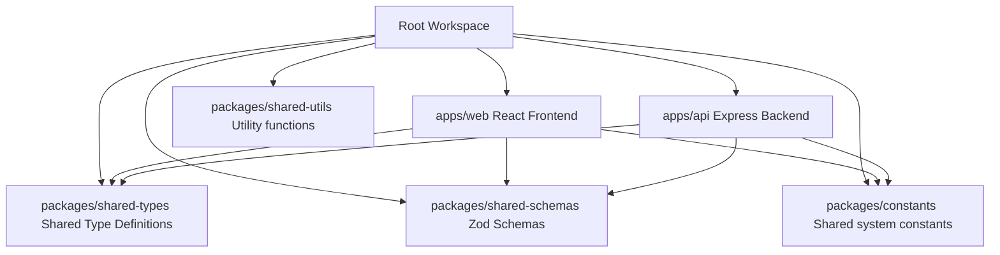

# Architectural Overview - CampusCare

This document details the software architecture, design principles, and technical stacks utilized in the **CampusCare Help Desk & IT Service Management Platform**.

## Monorepo Architecture

CampusCare uses a monorepo setup powered by `pnpm` workspaces:

## Layered Design Flow

The backend utilizes a decoupled, three-layer Service-Prisma architecture to handle requests:

1. **Routing Layer (`apps/api/src/modules/*/routes.ts`):** 
   - Receives HTTP requests, validates them via Zod schemas, and points to the appropriate controller.
2. **Controller Layer (`apps/api/src/modules/*/controller.ts`):**
   - Extracts request parameters, manages HTTP cookies/sessions, calls the underlying services, and wraps success outputs in a standard JSON envelope.
3. **Service Layer (`apps/api/src/modules/*/service.ts`):**
   - Encapsulates domain logic and queries the database client directly using the Prisma singleton instance.

## Frontend State Management & Styling

- **Server State:** Handled by `TanStack Query (v5)` for cache invalidation, loading states, and mutations.
- **Client State:** Handled by native React state hooks (`useState`, `useContext`) and React Router's URL params.
- **Styling:** Tailwind CSS v4 is used with a CSS-first approach. All customizations are declared inside `@theme` blocks in `globals.css` rather than static javascript files, allowing the build system to generate utility classes dynamically.
